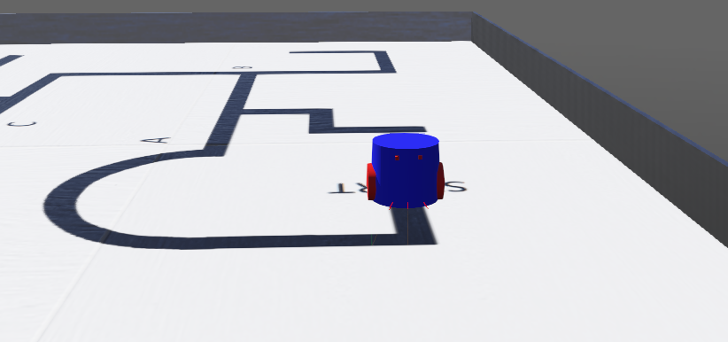
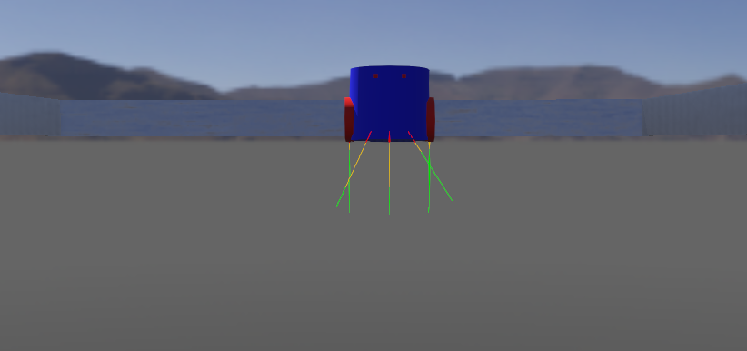

 
<h1> Line-Follower-Robot </h1>  
   
<h2>Team Name : RECREATOR</h2>

  <b>Line follower Robot</b> is an autonomous robot which follows either black line in white area or white line in black area. Robot must be able to detect particular line and keep following it.  
In this project, we design the <i>line follower robot which follows black line in white area.</i>

<h1>
  
Table of Content
</h1>
<ul>
  <li><a href="#table"> Table of Content</a></li>
  <li><a href="#head"> Line-Follower-Robot</a></li>
  <li><a href="#ARENA"> Arena</a></li>
  <li><a href="#Robot"> Robot, Sensor and Views</a></li>
  <li><a href="#Algorithem"> Algorithem</a></li>
  <li><a href="#vi"> Robot on Track</a></li>
  <li><a href="#Team-Member"> Team-Member</a></li>
  
</ul>    
  
<h1>
  
ARENA
</h1>

   

<h1>
  
Robot, Sensor and Views
</h1>

<h1>
  
Algorithem For My Project
</h1>

In our project, we used the LSRB algorithm to follow the given track.  
According to this algorithm: 
<b>1.</b> Always prefer a <b>left turn</b> over going 
  <b>straight</b> ahead or taking a right turn. 
<b>2.</b> Always prefer going <b>straight</b> over going
right.

<h1>
  
Robot On Track 
</h1>
  Watch my Robot running on given track.
  <a href="https://drive.google.com/file/d/1OVS8dSMOYkzItjtEzK5QLyf0a5KHxLyE/view?usp=sharing">Click here</a>
  
<h1>
  
Team-Member
</h1>

<ol start="1">
  <li> <a href="https://github.com/erdivyanshu"> Divyanshu Yadav</a> (Team-Leader)</li>
  <li> <a href="#"> Shaurya Raj Srivastava</a></li>
  <li> <a href="#"> Rishabh Gupta</a></li>
  <li> <a href="#"> Saurav Raj</a></li>
</ol>

